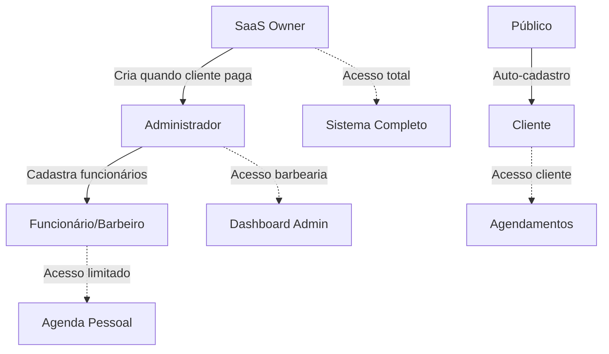

# Hierarquia de Usuários - StylloBarber

## 🏗️ Estrutura de Usuários

### 1. 👥 **Clientes** (Role: `client`)
- **Cadastro**: Formulário público de cadastro
- **Função**: `signUp()` - Cadastro público
- **Acesso**: 
  - Agendar serviços
  - Ver histórico de agendamentos
  - Gerenciar perfil pessoal
- **Criado por**: Auto-cadastro público

### 2. ✂️ **Funcionários/Barbeiros** (Role: `barber`)
- **Cadastro**: Apenas administradores podem cadastrar
- **Função**: `createEmployee()` - Cadastro por admin
- **Acesso**:
  - Ver agendamentos atribuídos
  - Gerenciar agenda pessoal
  - Atualizar status de serviços
  - Ver clientes e histórico
- **Criado por**: Administrador da barbearia

### 3. 👨‍💼 **Administradores** (Role: `admin`)
- **Cadastro**: Apenas SaaS Owner pode cadastrar
- **Função**: `createAdmin()` - Cadastro por SaaS Owner
- **Acesso**:
  - Gerenciar funcionários
  - Ver todos os agendamentos
  - Relatórios e dashboard completo
  - Configurar serviços e preços
  - Gerenciar clientes
- **Criado por**: SaaS Owner (quando paga mensalidade)

### 4. 🏢 **SaaS Owner** (Role: `saas_owner`)
- **Cadastro**: Criado manualmente no banco
- **Função**: Acesso direto ao banco de dados
- **Acesso**:
  - Criar administradores
  - Gerenciar barbearias
  - Dashboard global do sistema
  - Relatórios financeiros
  - Configurações do sistema
- **Criado por**: Desenvolvedor/Sistema

## 🔐 Fluxo de Criação



## 📋 Funções Disponíveis

### Contexto de Autenticação (`useAuth`)

```typescript
// Cadastro público (clientes)
const { signUp } = useAuth()
await signUp({
  nome: 'João Silva',
  email: 'joao@email.com',
  telefone: '(11) 99999-9999',
  senha: 'senha123',
  confirmarSenha: 'senha123'
})

// Cadastro de administrador (SaaS Owner)
const { createAdmin } = useAuth()
await createAdmin({
  nome: 'Admin Barbearia',
  email: 'admin@barbearia.com',
  telefone: '(11) 88888-8888',
  senha: 'admin123',
  confirmarSenha: 'admin123',
  barbeariaId: 'barbearia-uuid'
})

// Cadastro de funcionário (Admin)
const { createEmployee } = useAuth()
await createEmployee({
  nome: 'Barbeiro João',
  email: 'barbeiro@barbearia.com',
  telefone: '(11) 77777-7777',
  senha: 'barbeiro123',
  confirmarSenha: 'barbeiro123',
  barbeariaId: 'barbearia-uuid' // Obrigatório
})
```

## 🛡️ Proteção de Rotas

### Componentes de Proteção

```typescript
// Apenas clientes
<RouteGuard requiredRole="client">
  <ClientDashboard />
</RouteGuard>

// Apenas funcionários
<RouteGuard requiredRole="barber">
  <BarberSchedule />
</RouteGuard>

// Apenas administradores
<RouteGuard requiredRole="admin">
  <AdminDashboard />
</RouteGuard>

// Admin ou funcionário
<RouteGuard requiredRoles={['admin', 'barber']}>
  <ScheduleManagement />
</RouteGuard>

// Apenas SaaS Owner
<RouteGuard requiredRole="saas_owner">
  <SaasOwnerDashboard />
</RouteGuard>
```

## 🗄️ Estrutura do Banco

### Tabela `profiles`

```sql
CREATE TABLE profiles (
  id UUID PRIMARY KEY REFERENCES auth.users(id),
  nome VARCHAR NOT NULL,
  email VARCHAR NOT NULL,
  telefone VARCHAR,
  role VARCHAR NOT NULL CHECK (role IN ('client', 'barber', 'admin', 'saas_owner')),
  barbearia_id UUID REFERENCES barbearias(id), -- NULL para clientes e saas_owner
  avatar_url VARCHAR,
  pontos_fidelidade INTEGER DEFAULT 0,
  data_nascimento DATE,
  created_at TIMESTAMP DEFAULT NOW(),
  updated_at TIMESTAMP DEFAULT NOW()
);
```

### Políticas RLS (Row Level Security)

```sql
-- Clientes só veem próprio perfil
CREATE POLICY "Clients can view own profile" ON profiles
  FOR SELECT USING (auth.uid() = id AND role = 'client');

-- Funcionários veem próprio perfil + clientes da mesma barbearia
CREATE POLICY "Barbers can view clients" ON profiles
  FOR SELECT USING (
    auth.uid() = id OR 
    (role = 'client' AND barbearia_id = (
      SELECT barbearia_id FROM profiles WHERE id = auth.uid()
    ))
  );

-- Admins veem todos da mesma barbearia
CREATE POLICY "Admins can view barbearia users" ON profiles
  FOR SELECT USING (
    barbearia_id = (
      SELECT barbearia_id FROM profiles WHERE id = auth.uid()
    )
  );

-- SaaS Owner vê tudo
CREATE POLICY "SaaS Owner can view all" ON profiles
  FOR ALL USING (
    EXISTS (
      SELECT 1 FROM profiles 
      WHERE id = auth.uid() AND role = 'saas_owner'
    )
  );
```

## 🎯 Casos de Uso

### 1. Cliente se cadastra
```typescript
// Formulário público
const result = await signUp(clientData)
// Role automaticamente definido como 'client'
```

### 2. SaaS Owner cria admin para nova barbearia
```typescript
// Painel do SaaS Owner
const result = await createAdmin({
  ...adminData,
  barbeariaId: newBarbeariaId
})
```

### 3. Admin cadastra funcionário
```typescript
// Painel do Admin
const result = await createEmployee({
  ...employeeData,
  barbeariaId: currentUserBarbeariaId
})
```

## ⚠️ Regras Importantes

1. **Clientes**: Sempre role `client`, sem `barbearia_id`
2. **Funcionários**: Sempre role `barber`, com `barbearia_id` obrigatório
3. **Admins**: Sempre role `admin`, com `barbearia_id` opcional
4. **SaaS Owner**: Role `saas_owner`, sem `barbearia_id`

5. **Segurança**: Cada função valida permissões antes de criar usuário
6. **Isolamento**: Usuários só veem dados da própria barbearia
7. **Hierarquia**: Cada nível só pode criar níveis inferiores